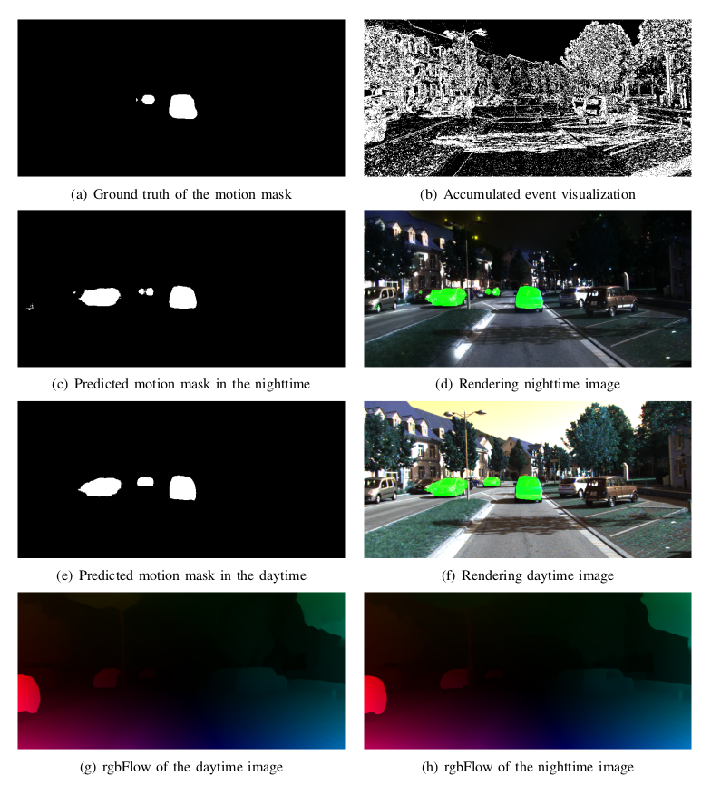

# EV-FuseMODNet


  

This repository contains the Minimal code for running inference associated with EV-FuseMODNet: Moving object detection using the fusion of event camera and frame camera.
The training part will be released later.

## Introduction
Moving object detection is a crucial task for autonomous vehicles. Indeed, dynamic objects represent higher collision risk than static ones, so the trajectories of the vehicles must be planned according to the motion forecasting of the moving participants of the scene. For the traditional frame-based cameras, images can provide accumulated pixel brightness without  temporal information between them. The optical flow computation is used as the inter-frame motion information. Interestingly, event-based camera can preserve the motion information by delivering the precise timestamp of each asynchronous event data, which is more suitable for the motion analysis. Also, the event-based cameras' high temporal resolution and high dynamic range allow them to work in fast motion and extreme light scenarios. In this work, we propose a new Deep Neural Network, called EV-FuseMODNet for Moving Object Detection (MOD) that captures motion and appearance information from both event-based and frame-based cameras. The proposed method has been evaluated with the extended KittiMoSeg dataset and the generated dark KITTI sequence. An overall 27.5\% relative improvement on the extended KittiMoSeg dataset compared to the state-of-the-art approaches has been achieved. 


## Dataset

The extended KittiMoSeg dataset can be found [__**here**__](https://sites.google.com/view/fusemodnet).

Download the motion masks files from the above link and their respective raw sequence from [__**KITTI**__](https://www.cvlibs.net/datasets/kitti/).

The datasets are prepared in the `datasets/KITTI_MOD` folder:

```Shell
├── datasets
    ├── KITTI_MOD
        ├── val
            ├── dark
                ├── sequential_name1
                    ├── '****.png'
                    ├── '****.png'
                ├── sequential_name2
                    ├── '****.png'
                    ├── '****.png'
            ├── images
                ├── sequential_name
                    ├── '****.png'
                    ├── '****.png'
                    ├── event_data
                        ├── '****.npy'
                        ├── '****.npy'
                ├── 'sequential_name'
                    ├── '****.png'
                    ├── '****.png'
                    ├── event_data
                        ├── '****.npy'
                        ├── '****.npy'
            ├── mask
                ├── sequential_name1
                    ├── '****.png'
                    ├── '****.png'
                ├── sequential_name2
                    ├── '****.png'
                    ├── '****.png'
        ├── training
            ├── dark
            ├── images
            ├── mask
```
The example dataset can be downloaded from [__**here**__](https://sites.google.com/view/fusemodnet).


## Pre-trained Model

The pretrained model can be found in [/pretrain](pretrain/) folder.


## Testing with flow visualization

The basic syntax is:

 ```python3 main.py -e --render --pretrained='checkpoint_path'``` 

## Acknowledgments

Parts of this code were derived from [princeton-vl/RAFT](https://github.com/princeton-vl/RAFT) and [TimoStoff/events_contrast_maximization](https://github.com/TimoStoff/events_contrast_maximization).